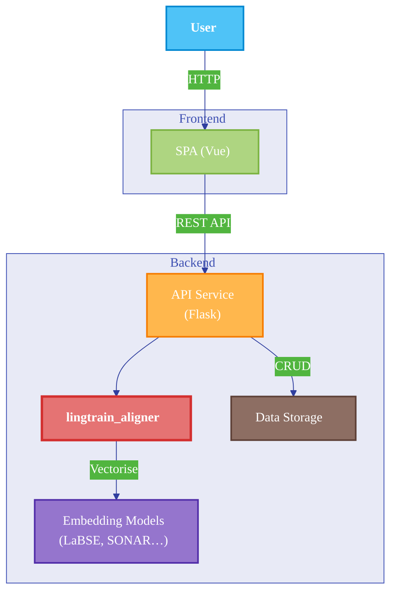

# Lingtrain Studio


## 📖 Overview

Lingtrain Studio is a powerful, open-source application designed for aligning texts in different languages. It leverages machine learning models to create high-quality parallel corpora, which can be used for a variety of purposes, including training translation models, creating bilingual books, and for language learning.

The application provides a user-friendly interface for aligning texts, as well as a tool for translators to edit and refine the alignments. It also supports a variety of models, allowing users to choose the best one for their specific needs.

## ✨ Features

- **Accurate Text Alignment**: Utilizes state-of-the-art sentence embedding models to accurately align texts in different languages.
- **Parallel Corpus Creation**: Extracts parallel corpora from two texts, which can be used for a variety of downstream tasks.
- **Bilingual Book Formatter**: Creates formatted parallel books with sentence highlighting, making them ideal for language learners.
- **Model Flexibility**: Supports a variety of sentence embedding models, including `distiluse-base-multilingual-cased-v2`, `LaBSE`, and `SONAR`.
- **User-Friendly Interface**: Provides a simple and intuitive interface for aligning texts and editing alignments.
- **Dockerized Deployment**: Can be easily deployed on a local machine or a server using Docker.

## 🏗️ Architecture



## 🚀 Getting Started

### Prerequisites

- [Docker](https://docs.docker.com/get-docker/)
- [Docker Compose](https://docs.docker.com/compose/install/)

### Installation

1. **Clone the repository:**

   ```bash
   git clone https://github.com/lingtrain/a-studio.git
   ```

2. **Navigate to the project directory:**

   ```bash
   cd a-studio
   ```

3. **Build and run the application using Docker Compose:**

   ```bash
   docker-compose build
   docker-compose up
   ```

The application will be available at `http://localhost:80`.

## 🛠️ Development

### Backend

The backend is a Flask/uwsgi REST API service that contains all the alignment logic.

1. **Navigate to the backend directory:**

   ```bash
   cd backend
   ```

2. **Install the required dependencies:**

   ```bash
   pip install -r requirements.txt
   ```

3. **Run the backend application:**

   ```bash
   python main.py
   ```

### Frontend

The frontend is a Vue.js single-page application that provides the user interface for the application.

1. **Navigate to the frontend directory:**

   ```bash
   cd frontend
   ```

2. **Install the required dependencies:**

   ```bash
   npm install
   ```

3. **Run the frontend application:**

   ```bash
   npm run serve
   ```

The frontend application will be available at `http://localhost:8080`.

## 🧬 Models

| Model                                     | Description                                                                                                                                                                                                                                                                                       | Languages              |
| ----------------------------------------- | ------------------------------------------------------------------------------------------------------------------------------------------------------------------------------------------------------------------------------------------------------------------------------------------------- | ---------------------- |
| `distiluse-base-multilingual-cased-v2`    | A fast and reliable model with a moderate size (500MB).                                                                                                                                                                                                                                                           | 50+                    |
| `LaBSE`                                   | A model that can be used for rare languages, but is pretty heavy (1.8GB).                                                                                                                                                                                                                         | 100+                   |
| `SONAR`                                   | A large model (3GB) that supports about 200 languages. It is recommended to explicitly indicate the source language when using this model.                                                                                                                                                             | ~200                   |

## 🤝 Contributing

Contributions are welcome! Please feel free to submit a pull request or open an issue if you find a bug or have a feature request.

## 📝 License

This project is licensed under the [Attribution-NonCommercial-NoDerivatives 4.0 International](http.creativecommons.org/licenses/by-nc-nd/4.0/) license. See the [LICENSE](LICENSE) file for more details.

## ⚡ Articles

Here are some articles about the project.

-  👅 [Язык твой — друг твой. Развиваем малые языки](https://habr.com/ru/articles/791188/)
-  🔥 [Lingtrain Studio. Книги для всех, даром](https://habr.com/ru/company/ods/blog/669990/)
-  🧩 [How to create bilingual books. Part 2. Lingtrain Alignment Studio](https://medium.com/@averoo/how-to-create-bilingual-books-part-2-lingtrain-alignment-studio-ffa56c9c07a6)
-  📘 [How to make a parallel texts for language learning. Part 1. Python and Colab version](https://medium.com/@averoo/how-to-make-a-parallel-book-for-language-learning-part-1-python-and-colab-version-cff09e379d8c)
-  🔮 [Lingtrain Aligner. Приложение для создания параллельных книг, которое вас удивит](https://habr.com/ru/post/564944/)
-  📌 [Сам себе Гутенберг. Делаем параллельные книги](https://habr.com/ru/post/557664/)
